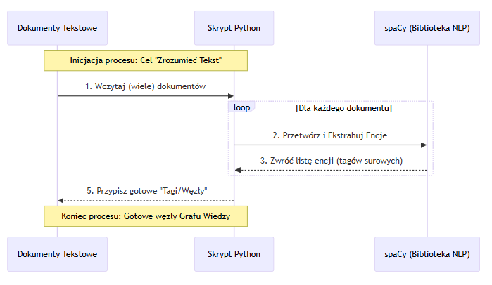
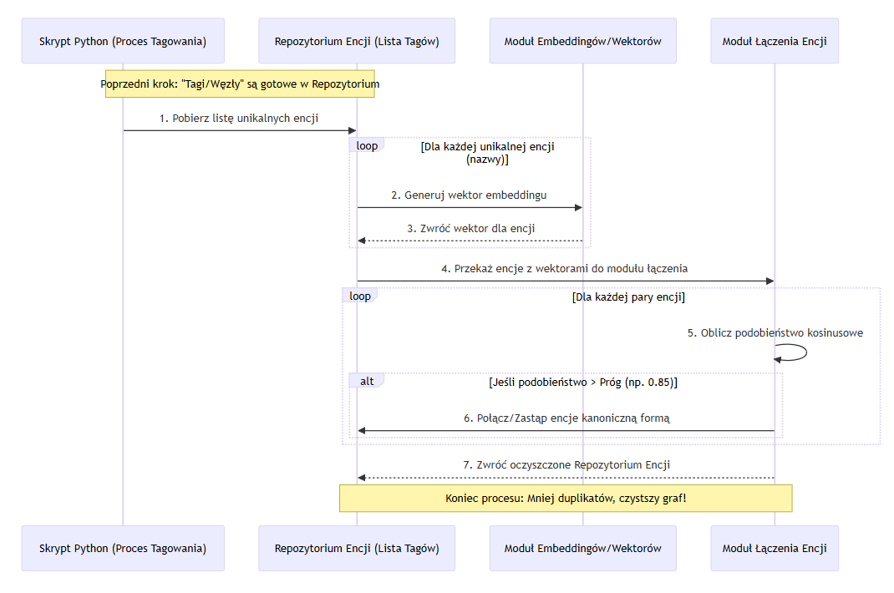
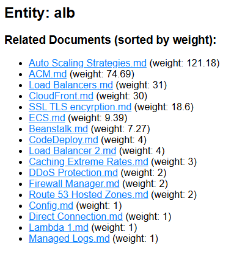
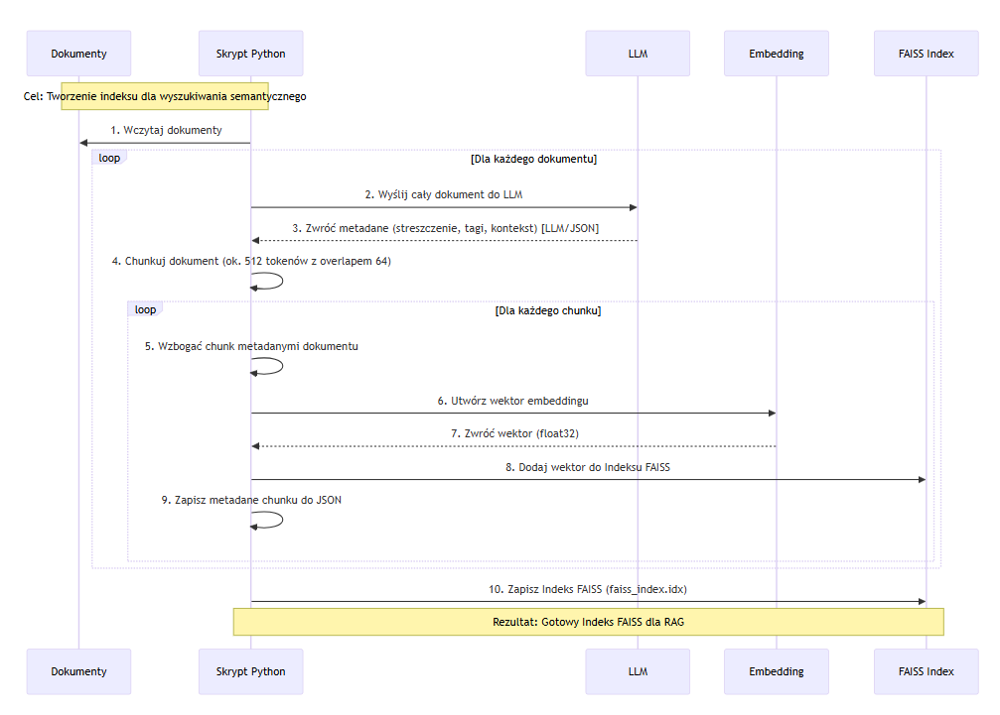
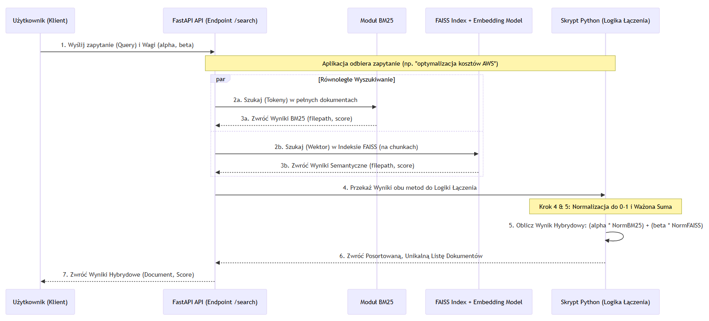
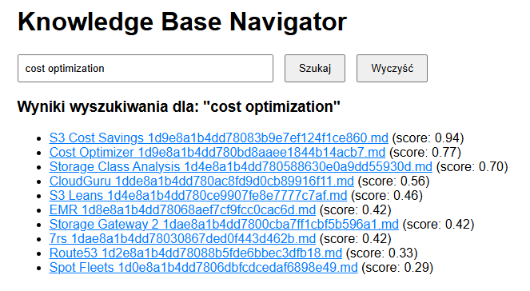
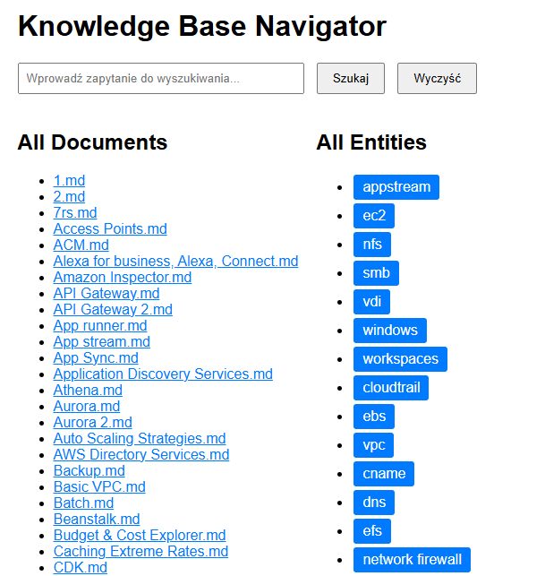
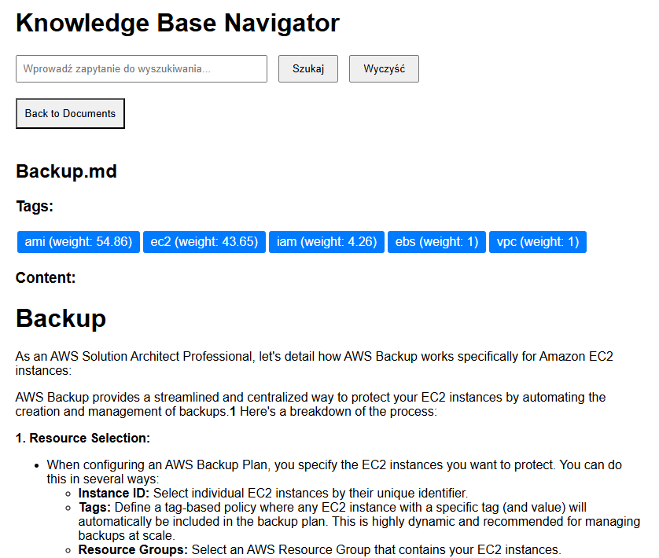

# Od Transkryptów Szkoleniowych do Grafu Wiedzy: Jak Połączyłem Notatki w Inteligentny Graf

Staram się, aby każde moje szkolenie w którym uczestniczę, było czymś więcej niż biernym słuchaniem. Dlatego korzystam z transkryptów, aby tworzyć notatki, które mogę później przeszukiwać i analizować. Te transkrypty zamieniłem na setki plików Markdown – każdy zawierał notatki z jednej lekcji. Brzmiało to obiecująco, ale szybko okazało się, że to tylko chaos: pliki bez linków, bez kontekstu, bez możliwości znalezienia powiązań między tematami.

W moim idealnym świecie chciałem mieć możliwość szybkiego wyszukiwania informacji, ale także eksplorowania powiązań między różnymi koncepcjami. Chciałem, aby moje notatki "rozumiały" siebie nawzajem i pomagały mi odkrywać nowe związki. Jest to szczególnie przydatne, gdy odświeżam materiał po dłuższym czasie lub gdy szukam powiązań między różnymi tematami. Postanowiłem więc stworzyć **graf wiedzy** – strukturę danych, która łączy ze sobą różne byty i ich relacje.

---

### Krok 1: Wyciągnięcie Kluczowych Koncepcji (NER) – Fundamenty Grafu

Pomyślałem: jak komputer ma "zrozumieć" tekst? Muszę wyciągnąć najważniejsze rzeczy – nazwy usług, technologie, pojęcia. To będą węzły mojego grafu wiedzy.

**Co zrobiłem:**
Napisałem prosty skrypt w Pythonie z biblioteką **spaCy**. Przetwarzał każdy dokument, wyciągał encje jak "Amazon S3" czy "VPC", i filtrował rzadkie, żeby skupić się na istotnych. Rezultat? Lista "tagów" dla każdego dokumentu – gotowe węzły!



Przykładowe wyniki ekstrakcji encji:
| Dokument | Encje |
| -------- | --------------------------------------------------- |
| SQS.md | auto scaling groups |
| | simple queue service |
| | queue |
| | sqs |
| | fifo |

---

### Krok 2: Łączenie Podobnych Encji – Czystość i Spójność

NER nie jest idealny – może widzieć podobne encje jako różne, np. "AWS S3" i "Amazon S3" jako oddzielne rzeczy. To prowadzi do duplikatów w grafie, co psuje całą strukturę. Wpadłem na pomysł, aby je połączyć, żeby graf był czysty i spójny. Jak to zrobić? Używając embeddingów – wektorów, które mierzą semantyczne podobieństwo nazw.

**Co zrobiłem:**
Napisałem skrypt w Pythonie, który tworzył wektory dla każdej unikalnej nazwy encji, następnie obliczał podobieństwo kosinusowe między parami i łączył te powyżej progu (np. 0.85) w jedną kanoniczną formę. Rezultat? Znacząco mniej duplikatów i czystszy graf!



Przykładowe połączenia encji:
| Oryginalne Encje | Połączona Encja |
|-----------------------|-------------------|
| AWS S3, Amazon S3, AWS S3, Simple Storage Service | S3 |
| VPC, Virtual Private Cloud | VPC |

---

### Krok 3: Budowa Grafu Współwystępowania – Pierwsze Połączenia

Mam już węzły (encje). Jak stworzyć między nimi połączenia (krawędzie)? Najprostsza idea: jeśli dwie encje występują w tym samym dokumencie, są powiązane. To będzie krawędzią w grafie – intuicyjna metoda współwystępowania.

**Co zrobiłem:**
Użyłem biblioteki **NetworkX** do stworzenia grafu. Węzły to oczyszczone encje, krawędzie łączą te, które współwystępują w dokumentach. Rezultat? Sieć powiązań, gdzie widać, że "EC2" często łączy się z "VPC" i "Security Group". Ukryte relacje wyszły na jaw!


Przykładowe połączenia w grafie:
| Encja 1 | Encja 2 | Liczba Współwystępowania |
|---------|---------|--------------------------|
| EC2 | VPC | 10 |
| EC2 | IAM | 9 |
| EC2 | DNS | 6 |

| Dokument | Encja                           |
| -------- | ------------------------------- |
| SAM.md   | sam, codedeploy, cloudformation |

| Encja | Dokumenty Występowania                        |
| ----- | --------------------------------------------- |
| rds   | RDS.md, Aurora 2.md, Route 53 Hosted Zones.md |

**Disclaimer:** Produkcyjne systemy grafowe (np. Neo4j, Amazon Neptune) oferują lepszą skalowalność i wydajność niż NetworkX, który jest bardziej narzędziem do prototypowania i analizy w pamięci.
---

### Krok 4: Wzbogacenie Grafu o Wagi (Graf Hybrydowy) – Siła Połączeń

Nie wszystkie połączenia są równe – relacja między "S3" a "Lifecycle Policy" jest silniejsza niż z "Security". Jak zmierzyć tę siłę? Używając algorytmów jak BM25, które oceniają ważność encji w dokumentach. Wynik da wagi krawędziom.

**Co zrobiłem:**
Napisałem kod, który obliczał wagi dla każdej pary encji w dokumentach za pomocą BM25, sumował je po wszystkich wystąpieniach, i dodał węzły dokumentów połączone z encjami. Rezultat? Ważony graf hybrydowy – relacje z prawdziwą siłą! Dzięki temu mogę teraz priorytetyzować silniejsze powiązania podczas analizy i wyszukiwania.




#### Prosta Formuła Wagi

Aby zrozumieć, jak ważna jest dana encja w dokumencie, używamy prostej formuły:

**Waga = Liczba Wystąpień × (1 + Ważność Metody) × Mnożnik Pozycji**

- **Liczba Wystąpień**: Ile razy encja pojawia się w dokumencie. Im więcej, tym ważniejsza – to podstawowa miara obecności.
- **Ważność Metody**: Wynik z algorytmu BM25, który mierzy, jak unikalna i istotna jest encja w kontekście całego zbioru dokumentów. Dodaje "inteligentny" bonus.
- **Mnożnik Pozycji**: Bonus za pozycję w dokumencie – 5x jeśli encja jest w tytule (główny temat), 1.5x jeśli we wprowadzeniu (wczesny kontekst), 1x dla reszty. To podkreśla kluczowe miejsca.


> waga_totalna = liczba_wystąpień * (1 + ważność_metody) * mnożnik_pozycji

Jest to formuła nie oparta na żadnej literaturze naukowej. Tutaj najlepiej byłoby eksperymentować i dostosować ją do konkretnego przypadku użycia.

---

### Krok 5: Tworzenie Indeksów dla Szybkiego Wyszukiwania (FAISS)

Graf jest świetny do analizy, ale do wyszukiwania semantycznego potrzebuję czegoś jeszcze. Podzielę dokumenty na mniejsze fragmenty, a następnie przekształcę je w wektory za pomocą modelu językowego. Aby wyszukiwanie było jeszcze lepsze, wzbogacę każdy chunk o metadane z całego dokumentu (streszczenie, tagi), wygenerowane przez LLM. Na koniec, wszystkie wektory umieszczę w indeksie **FAISS**, który umożliwia ultraszybkie wyszukiwanie najbliższych sąsiadów.

**Co zrobiłem:**
Napisałem skrypt w Pythonie, który dzielił każdy dokument na fragmenty o długości ok. 300-400 tokenów z nałożeniem (overlap), aby nie utracić kontekstu. Następnie, za pomocą API OpenRouter i modelu Grok, wzbogaciłem każdy dokument o streszczenie, tagi i kontekst. Każdy chunk połączyłem z tymi metadanami, przekształciłem w wektor za pomocą modelu embeddingów, i zapisałem wszystko w indeksie FAISS. Rezultat? Ultraszybkie wyszukiwanie semantyczne, gotowe do hybrydowego łączenia z BM25!



```json
    {
        "filename": "SQS.md",
        "filepath": "filepath_here",
        "document_title": "SQS",
        "chunk_id": 0,
        "chunk_text": "Chunk text here...",
        "enriched_metadata": {
            "chain_of_thought": "First, I read through the entire document to understand its content, which is a detailed guide on AWS SQS ...",
            "summary": "This document outlines the key features, benefits, and best practices of AWS SQS, including its use for decoupling services...",
            "tags": [
                "AWS",
                "SQS",
                "..."
            ],
            "context": "The document provides thematic guidance on using Amazon SQS...."
        }
    },
```

Użyłem chain-of-thought, aby LLM mógł lepiej zrozumieć strukturę dokumentu i wygenerować trafniejsze streszczenia oraz tagi.

Następnie enriched_metadata zostało powiązane z każdym chunkem, co pozwala na bardziej kontekstowe wyszukiwanie.

> enriched_chunk = chunk + enriched_metadata

---

### Krok 6: API do Wyszukiwania Hybrydowego (FastAPI)

Mam teraz dwa potężne narzędzia: wyszukiwanie słownikowe (BM25) i semantyczne (FAISS). Jak je udostępnić w łatwy sposób? Zbuduję proste API za pomocą **FastAPI**, które połączy siłę obu tych podejść w jedno **wyszukiwanie hybrydowe**.

**Co zrobiłem:**
Napisałem aplikację w FastAPI z endpointem `/search`, który przyjmuje zapytanie od użytkownika, równolegle wykonuje wyszukiwanie BM25 (dopasowanie słów kluczowych) i FAISS (dopasowanie znaczeniowe), normalizuje wyniki do skali 0-1, łączy je ważoną sumą (np. 40% semantyczne, 60% BM25), i zwraca posortowaną listę dokumentów bez duplikatów. Rezultat? Hybrydowe wyszukiwanie, które daje najlepsze z obu światów – precyzję słów i głębię znaczenia!






---

### Krok 7: Stworzenie Interfejsu Użytkownika – Łatwy Dostęp do Wiedzy

Gdy już posiadam wszystkie komponenty – graf wiedzy, indeks FAISS i API wyszukiwania hybrydowego – nadszedł czas, aby to wszystko połączyć w przyjazny dla użytkownika interfejs. Sama wizualizacja grafu nie jest dla mnie w żadnym stopniu użyteczna, natomiast interaktywne narzędzie do eksploracji i wyszukiwania to zupełnie inna sprawa. 

**Co zrobiłem:**
Napisałem prostą aplikację webową, czysty HTML + JS, która korzysta z mojego API FastAPI do wyszukiwania. Użytkownik może wpisać zapytanie, a wyniki są wyświetlane w czytelny sposób, z linkami do odpowiednich dokumentów. Dodatkowo, dodałem możliwość eksploracji grafu wiedzy – klikając na encje, można zobaczyć powiązane dokumenty, oraz gdy już znajdzie się interesujący dokument, można zobaczyć powiązane encje i dalej eksplorować.

Zrobiłem to za pomocą dynamicznego HTML i JavaScript, który to pobierał graf z pliku JSON i renderował go interaktywnie na stronie. Jest to proste, ale nieoptymalne rozwiązanie. Najlepszym podejściem byłoby wygenerować wszystkie strony statyczne podczas budowy grafu, aby uniknąć ładowania dużych plików JSON po stronie klienta.



*Widok główny aplikacji z polem wyszukiwania*

*Widok dla otworzonego dokumentu z powiązanymi encjami*

*Wyniki wyszukiwania dla encji "alb"*

*Wyniki wyszukiwania hybrydowego "cost optimization"*

## Podsumowanie

### Konkluzje z Kroków

- **Krok 1 (NER):** Ekstrakcja encji za pomocą spaCy i lokalnego modelu NER to kluczowy fundament grafu wiedzy – automatyzuje identyfikację kluczowych koncepcji bez ręcznej pracy, ale wymaga filtrowania rzadkich encji, aby skupić się na istotnych.
- **Krok 2 (Łączenie encji):** Użycie embeddingów do łączenia podobnych encji znacząco poprawia czystość grafu, redukując duplikaty i zapewniając spójność struktury.
- **Krok 3 (Graf współwystępowania):** Prosta metoda współwystępowania ujawnia ukryte relacje między encjami, idealna do eksploracji powiązań w dużych zbiorach dokumentów.
- **Krok 4 (Wagi hybrydowe):** Dodanie wag z BM25 i pozycjonowaniem tworzy graf z prawdziwą siłą połączeń, pozwalając priorytetyzować kluczowe linki podczas analizy i wyszukiwania.
- **Krok 5 (Indeks FAISS):** Wzbogacanie dokumentów metadanymi za pomocą LLM i indeksowanie umożliwia wyszukiwanie semantyczne.
- **Krok 6 (Hybrydowe API):** Łączenie BM25 i FAISS w API FastAPI daje najlepsze z obu światów – precyzję słów kluczowych i głębię znaczenia.

Bawiłem się świetnie, budując ten system od podstaw. Można powiedzieć, że stworzyłem coś na kształt **infretrieval retrieval**, czyli **R** w bardzo popularnych rozwiązaniach typu RAG (Retrieval-Augmented Generation). 

To tylko utrwala mnie w przekonaniu, że naiwne aplikacje typu RAG to nie tylko embeddingi, ale również BM25 i inne klasyczne metody wyszukiwania informacji, ba nawet bez embeddingów da się zbudować całkiem użyteczny system.


