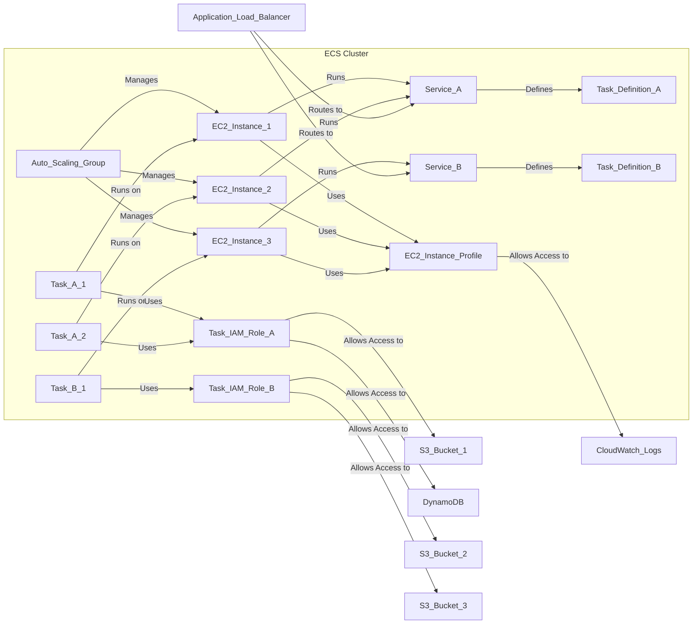

# ECS

# **Amazon Elastic Container Service (ECS) - Key Concepts**

## **1. Docker Fundamentals**

- **Docker as a Deployment Platform:** Software development platform for deploying applications.
- **Containerization:** Applications are packaged into containers.
- **OS Agnostic:** Containers can run on any operating system consistently.
- **Predictable Behavior:** Eliminates compatibility issues across different environments.
- **Efficiency:** Easier to maintain, works with any language, OS, and technology.
- **Resource Control:** Ability to allocate specific memory and CPU to each container.
- **Scalability:** Containers can be scaled up and down quickly.
- **Efficiency vs. VMs:** Generally more resource-efficient than virtual machines.

## **2. Container Management on AWS**

- **Amazon ECS (Elastic Container Service):** Amazon's proprietary container orchestration platform.
- **Amazon EKS (Elastic Kubernetes Service):** Amazon's managed Kubernetes service (open-source).
- **AWS Fargate:** Serverless compute engine for containers, works with both ECS and EKS.

## **3. Amazon ECS Deep Dive**

### **3.1. Use Cases**

- **Microservices:** Running and managing distributed microservice architectures.
- **Service Discovery:** Facilitating communication between microservices.
- **Load Balancing Integration:** Direct integration with Application Load Balancer (ALB) and Network Load Balancer (NLB).
- **Auto Scaling:** Dynamically scaling the number of tasks based on demand.
- **Batch Processing & Scheduled Tasks:** Running one-off or recurring tasks.
- **Cloud Migration:** Migrating existing Dockerized applications to AWS.

### **3.2. Core Concepts**

- **ECS Cluster:** A logical grouping of EC2 instances.
- **ECS Service:** Defines the desired number of tasks to run and how they should be deployed and maintained.
- **Task Definition:** A JSON blueprint specifying how to run a Docker container (image name, CPU, RAM, etc.).
- **ECS Task:** An instantiation of a task definition running within a service, containing one or more Docker containers.
- **ECS IAM Roles:**
    - **EC2 Instance Profile:** IAM role attached to the EC2 instances in the cluster, allowing them to make API calls to the ECS service (e.g., sending logs).
    - **ECS Task IAM Role:** IAM role associated with individual ECS tasks, granting them specific permissions to access other AWS services (e.g., S3, DynamoDB).

### **3.3. Architecture Diagram (Conceptual)**

**Fragment kodu**

### **3.4. Application Load Balancer (ALB) Integration**

- **Dynamic Port Mapping:** Allows running multiple instances of the same application (Docker container) on the same EC2 instance.
- The ALB automatically discovers the dynamically assigned port for each container.
- **Benefits:**
    - Increased resiliency (multiple containers per instance).
    - Maximized resource utilization (CPU and cores).
    - Facilitates rolling upgrades (one task at a time).

## **4. AWS Fargate**

- **Serverless Container Platform:** No need to provision or manage underlying EC2 instances.
- **Abstraction of Infrastructure:** Users don't interact with the underlying hardware.
- **Integration with ECS:** Fargate runs on top of ECS.
- **Task-Level Resource Provisioning:** Specify CPU and RAM requirements per task.
- **Simplified Scaling:** Scale by adjusting the number of tasks.
- **Convenience:** Easier to manage ECS services without EC2 instance management.

## **5. Security and Networking**

- **Secrets Management:** Inject secrets and configurations as environment variables using SSM Parameter Store and Secrets Manager.
- **ECS Task Networking Modes:**
    - **None:** No network connectivity.
    - **Bridge:** Uses Docker's internal virtual network.
    - **Host:** Bypasses Docker networking and uses the host's network interface.
    - **AWSVPC:** Each ECS task gets its own Elastic Network Interface (ENI) and private IP address within the VPC.
        - Provides simplified networking and enhanced security (security groups, VPC Flow Logs).
        - Default mode for Fargate tasks.

## **6. Service Auto Scaling**

- **Automatic Task Scaling:** Dynamically adjusts the desired number of tasks in a service based on metrics.
- **Leverages Application Auto Scaling:** ECS service uses the AWS Application Auto Scaling service in the backend.
- **Scaling Options:**
    - **Target Tracking:** Scale based on a target value for a CloudWatch metric (e.g., CPU utilization).
    - **Step Scaling:** Define scaling adjustments based on metric thresholds.
    - **Scheduled Scaling:** Scale based on predefined schedules.
- **Considerations for EC2 Launch Type:** When using EC2 instances, ensure the underlying EC2 Auto Scaling Group also scales to provide sufficient capacity.
- **Fargate Auto Scaling:** Simpler to set up as it's serverless and doesn't require managing EC2 instance scaling.

## **7. Spot Instances**

- **Cost Savings:** Utilize spare EC2 capacity at a significantly reduced price.
- **ECS (EC2 Launch Type):** Underlying EC2 instances in the ASG can be spot instances.
- **Draining Mode:** When a spot instance is reclaimed, ECS can put it in draining mode to gracefully remove tasks.
- **Impact on Reliability:** Spot instances can be interrupted, potentially affecting application availability.
- **Fargate Spot:** Option to run Fargate tasks on spare capacity for cost savings.
- **On-Demand Base:** Can specify a minimum number of on-demand Fargate tasks for baseline reliability.
- **Fargate Scalability:** Regardless of on-demand or spot, Fargate scales easily based on load.

## **8. Amazon Elastic Container Registry (ECR)**

- **Docker Image Registry:** Fully managed Docker container registry service.
- **Private and Public Repositories:** Store and manage private images for your account and public images for sharing.
- **IAM Integration:** Access control to ECR repositories is managed through IAM policies.
- **Image Pulling:** EC2 instances (with the correct IAM role) can pull images from ECR to run ECS tasks.
- **Features:**
    - Image vulnerability scanning.
    - Image versioning and tagging.
    - Image lifecycle management.

These notes provide a comprehensive overview of Amazon ECS based on the provided transcription, focusing on clarity and organization for better understanding.